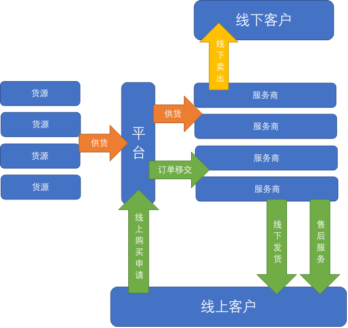

# 以案例OK无忧分析中国地区内B2B电子商务的新模式

## ——探究B2B网商的运营

### 主要作者：吴越，刘浩宇，李宁远

## 摘要

在对案例“OK无忧”的分析当中，研究了B2B网商的“一个平台，两个用途”资源整合方案及“参与者”身份。

## 关键词：
### 电子商务，服务模式，服务类型

## 1 研究背景

B2B是指企业与企业之间通过专用网络或Internet，进行数据信息的交换、传递，开展交易活动的商业模式。在电子商务的众多模式中，B2B电子商务具有以下几种特点：

* 交易额通常比较大
* 在我国盈利状态好
* 不存在或较少存在C2C、B2C网商中的信任危机问题

在淘宝、京东等平台日益火爆的今天，我们往往更为关注C2C、B2C等服务于单一消费者的商业模式。但是B2B作为企业与企业之间交易活动的重要模式，其实在我们的生活中也扮演着重要的角色。比如企业采购办公用品就是B2B的重要实现形式之一。在一些产业链条复杂的行业中，一环与一环之间的无缝接轨就需要B2B的参与。

故本次社会实践本小组对B2B网商的运营进行了研究讨论。

## 2 研究目的

- [x] 了解B2B商业模式的内涵，并以OK无忧为案例分析这种模式的优点。
- [x] 了解电子商务平台的运营方式及后台操作，并以实习者的身份亲身体验平台运营中较基础的工作。
- [x] 了解网商平台的线下运营模式并以OK无忧为案例分析其优点。

## 3 研究意义

- [x] 更早地接触、了解电商平台的运营，有助于我们新时代的青少年形成对商业模式的初步认识。
- [x] 通过亲身体验平台操作，学习信息技术方面的技巧，提高自身对互联网认识的知识水平。
- [x] 锻炼我们自己发现问题、探究问题、解决问题的能力。

## 4 研究对象及研究过程

本次社会实践本小组寻访了[OK无忧](http://www.okwuyou.com/)。它是一家以打造“您身边的IT服务商”为宗旨，主要在杭州市进行IT市场、办公用品耗材等的B2B网商的电子商务平台。“OK无忧”平台是我国首家面向IT产业生态链，提供的集电商产品销售、信息共享、金融服务，为消费者提供专业化服务的新型综合性电商平台。

该平台采用了一种新的B2B电商运营模式，有其独特的优势。

小组成员经过在OK无忧的多天学习参与，仔细学习研究了平台的经营管理、运营模式、配送模式，并参与到公司的部分工作中，切身地了解了公司的运营，也引发了我们对OK无忧的新型运营模式的思考。

经过学习了解，该平台的运营模式如下：

1. 通过注册及审核在杭州各个实体店或有志于网商的企业中找出一批“服务商”，遍布城市的各个区域，为平台提供线下专业化本地服务。
1. 平台通过联系工厂等直接货源来购入优质、廉价的货源，然后收录到仓库。
1. 服务商可以以较为优惠的价格购买到平台的货品（平台在这一步得到利润），平台从仓库发货，然后服务商以线下的方式卖出（服务商得到的线下部分的利润）。
1. 对于一般用户（通常也是企业，个人也可以购买），他们可以以正常身份（即非服务商身份）在同一个平台（即“一个平台，两个用途”）购买同样的产品，然后平台将货单发送到服务商处。平台会选择最优的服务商，考虑包括距离，服务品质等因素。此时，
	* 若服务商已经在第4步中买入了产品，则服务商需要将货品发出至最终用户处（服务商承担的责任），而这次交易的差价仍由服务商获取（服务商得到的线上部分的利润）。
	* 否则，平台会通过各种渠道将仓库中的货品发到该服务商处，然后由服务商继续交易。
1. 在交易完成之后，由该发出货品的服务商承担售后服务。

因此，这样的平台是整个B2B运营过程中的参与者，为线下商务提供了货源与客源的同时自身获得了利润。

这样的运营模式具有如下优点：

* 解决了快递的“最后一公里”问题，为最终用户的收取使用提供了方便。
* 通过“一个平台，两个用途”将“从供应商到经销商”的B2B部分和“从经销商到最终用户”的B2B或B2C部分有机地统一了起来，提高了平台的统一性、高效性和复用性。
* 为线下商户统一提供了可靠、优质的货源。
* 解决了线下供应商无法简单地进行线上销售的问题。
* 简单地说，就是将“货”与“人”（客户）这两种资源在同一个平台上进行了整合，

这种运营模式和[当当网](http://www.dangdang.com/)、[亚马逊](https://www.amazon.cn/)等B2C网商，[淘宝](https://www.taobao.com/)、[京东](https://www.jd.com/)C2C网商的区别如下：

分类| 传统网商 | 新的运营模式
:-:|:-:|:-:
物流| 依赖于物流公司 | 依赖于服务商的配送
售后| 由网店解决，如果网店出现问题则售后服务失去保证 | 由服务商解决，平台提供相应的争议介入制度
经销商模式|网店独自宣传、销售，有良好的竞争环境|统一宣传、配单，竞争较少，避免恶性竞争同时带来其他问题
平台地位与利润|只是网店的架构，没有较大收入，但是用户群较广，便于下一步发展|“一个平台，两个用途”，且平台拥有一部分利润
适用范围|一个真正的“平台”，网店自主搭建、与平台独立，网页服务可以进一步投放广告等|平台作为独立收入的企业，是B2B网商运营过程中的“参与者”，得到收入的一部分

我们还发现，OK无忧在电子商务平台竞争激励的现实背景下，以销售IT设备为基础开展销售，并逐渐开始扩大自己的覆盖范围，通过办公用品、文具用品等多类型查案品的销售，不但成功地与一些大型国企、央企甚至是杭州市政府、浙江省政府合作，获得了更大的利润，而且树立了自己的品牌形象，提高了自身在电商平台的影响力，也促进了生产-销售的良性循环。这不仅体现了OK无忧在产品经营的选择上的专精，也说明企业敢于大胆决策，迈出新的步伐。这也是OK无忧的优势所在。

## 5 结论与思考

通过这次社会实践，我们不仅开拓了眼界，更从中获得了许多有益的启示和思考。

1. 运营模式的创新转变往往能带动企业的崛起
	- 当今社会，如果有人提到网商，那么大多数人都会不由自主地联想到淘宝。淘宝由于其店铺众多，且大多为私人经营，故卖家的配送均通过物流来完成。但OK无忧作为一家IT服务商，如果采用B2C的形式，不仅因为物件较大而导致配送麻烦、物流成本高，还会影响企业的经营效率。而事实上，OK无忧采取了B2B兼有B2C的模式，即OK无忧作为供销商只与下级服务商联系，并将与个人消费者的交易让给了下级服务商去完成。
	- 通过这种方式，企业将“从供应商到经销商”的B2B部分和“从经销商到最终用户”的B2B或B2C部分有机地统一了起来。从企业自身来讲，在获得利润的同时，能减轻企业在配送方面的压力，只需将商品送至各服务商即可，还能免去与个体消费者的种种纠纷；从服务商的角度看，他们也能从中获取较大的利润，而且相比于自己经营，免去了很多决策上的问题；作为消费者，OK无忧自动筛选最近的服务商派送的机制保证了购买者能在最快的时间收到商品，一旦需要维修或更换，他们也可以更方便地找到服务商进行维修处理。这样，“一个平台，两个用途”给OK无忧、服务商、消费者均带来了便捷，形成了一种“三赢”的局面。
	- 而OK无忧的成功，正是因为经营模式的创新转变，在传统网商的运营模式中增加了下级服务商一环。别看只是微小的转变，这一环有效地衔接了整个配送流程，起到了至关重要的作用。因此OK无忧在服务商的选择上也动足了脑筋：通过注册及审核在杭州各个实体店或有志于网商的企业中找出一批“服务商”，遍布城市的各个区域，为平台提供线下专业化本地服务。这就保证了企业与服务商合作的顺利进行，也保证了消费者拥有良好的售后服务和维权途径。所以，OK无忧迅速崛起的关键在于运营模式的转变，运营模式的创新转变往往能带动企业的崛起。
1. 坚持“专精”，才能让企业立足于不败之地
	- 在生活中我们常说，人要有自己的特长，而不应做一个什么都会，但什么都学得不深的人。这就强调了做人要”专精”。经营企业也是如此。淘宝电商的辉煌，从本质上看来源于店铺之多，所以能满足不同人群的需求，得到人们的青睐。在这一点上，一家独立经营的企业就无法做到”涉猎”如此之广，只能专于个别的优势领域，否则只会在与电商巨头的竞争中溃败。而OK无忧正是专注于电脑设备和办公用品，才能蓬勃发展起来。
	- OK无忧在创立初期一直经营电脑及其配件、办公耗材、文具用品等，抓住了这一类商品在淘宝等传统电商平台上不便于销售和运输的特点，扬长避短，所以才能使企业立足。OK无忧在办公用品、电脑配件方面的专精也获得了政府的青睐，也让企业拥有了与杭州市政府、浙江省政府合作的机会，在企业的网站上有专门的链接，能直接供政府采购商品。
	- 在获得了初期的成功后，OK无忧才开始进一步地涉足其他领域，如我们现在可以在网站上看到的医疗保健、日用百货、食品饮料、生活电器等领域。这一举措并不是放弃了最初的专精，而是在做好自己原有业务的基础上的一次尝试和突破。这也表现了OK无忧敢于迈出步伐、投身于市场的激情。从这一点上，我们真切地认识到了，坚持“专精”，才能让企业立足于不败之地。
1. 只有紧跟潮流，走在时代的前沿，才能赢得未来
	- OK无忧的成功还在于它能”走在时代的前沿”。OK无忧创设的这种“一个平台，两个用途”的电子商务新模式，已经逐渐成为了小企业电商成功地范例，也慢慢地为大多数人所接受。曾经也有很多红极一时的电子商务平台，但很多因为一味地模仿、没有创新而逐渐被市场所淘汰。OK无忧在学习淘宝等电商平台的基础上，推陈出新，”玩出了自己的花样”，让更多的人认识到了电商平台的发展方式可以如此多种多样。我们有理由大胆憧憬，”企业-服务商-消费者”这种销售链条和体系，以后将会成为电商平台的主流。
	- 同样，作为新时代芸芸众生中的一员，我们也只有紧跟潮流，才能不被时代的大浪打倒。在几天的实践活动中，我们也充分认识到了信息技术在办公中的重要应用。小组中的史添能同学还用自己丰富的知识为企业的加密技术方面提出了建议，这更是让我们体会到了学好信息技术的重要性和必要性。大家无不认为，只有紧跟潮流，才能使企业赢得光明的前景，才能使一个人拥有美好的未来。

## 6 结束语

通过这次社会实践活动，我们小组成员学习到了电子商务平台的相关知识，认识到了电商平台发展的无限潜力。这次活动让我们锻炼了自己发现问题、探究问题、解决问题的能力，也使我们更加了解彼此。同时，这次活动也使我们发现了一些不足的地方，比如在实践之前对实践的企业了解不够充分、实践报告的书写上不够熟练等问题，克服这些问题也是我们在今后的研究性学习中努力的方向。

## 7 致谢

感谢OK无忧的工作人员对我们热情的接待以及对实践活动的大力支持；

感谢帮助我们联系实践地点的班主任朱老师和同学家长。

## 8 参考文献

1. [百度百科-B2B](http://baike.baidu.com/item/b2b)
2. [OK无忧官网-关于](http://www.okwuyou.com/member/article-show-article_id-22.html)
